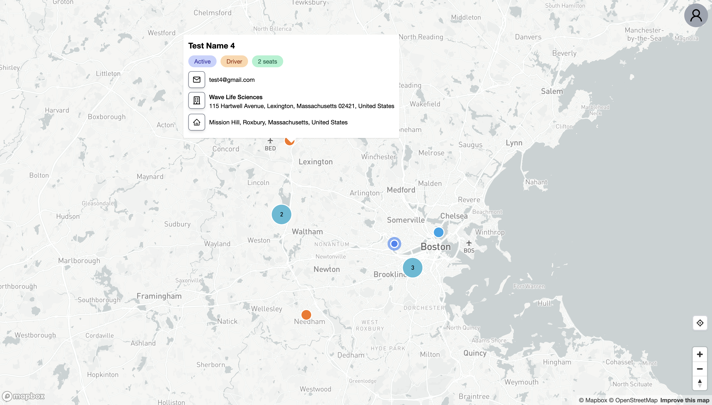

# NU Carpool

This is a web app for Northeastern University's students to assists them in finding groups for carpooling while on co-op.



## Get Started

- Clone the project, add environment variables (listed below) in `.env`.

```env
# Prisma

DATABASE_URL=

# Next Auth

NEXTAUTH_SECRET=
NEXTAUTH_URL=

# Next Auth Google Provider

GOOGLE_CLIENT_ID=
GOOGLE_CLIENT_SECRET=

# Mapbox

NEXT_PUBLIC_MAPBOX_ACCESS_TOKEN=
```

Then do `yarn` and `yarn dev` to get the project running.

## Running Docker/Prisma/MySQL

To start the database locally, start Docker Engine on your computer and then run `yarn db:start`. Once you're done, make sure to run `yarn db:stop` for cleanup. To persist database information, a new folder will be created locally named `nucarpool-db-data`, but this will not be included in git. 

When the [schema](./prisma/schema.prisma) is updated, you will need to run `yarn db:schema` to update the MySQL database running under the hood. When prompted for a name, provide a short, informative name about the updates to the database, with underscores between words (snake_case). This command will also automatically update the client object used in the frontend.

## Tech Stack

- Framework: NextJS + Typescript
- Component Library: TailwindCSS + Headless UI
- Authentication: NextAuth
- Map API: Mapbox
- Backend: Serverless with trpc + Prisma + mysql (hosted on PlanetScale)

This is also known as the T3 Stack. More details can be found [here](https://init.tips).

## Features

- Google OAuth authentication
- Autocomplete address fields using Mapbox Geocoding API and Headless UI
- Display students' co-op location and info on a map with colored markers
- Settings page for student to change their info
- Responsive for different screen size

## Todos

- [ ] Fix bug where students at the same company will not be displayed, except for the last one
- [ ] Create a legend for different types of users on the map
- [ ] Migrate to Northeastern SSO
- [ ] Add a delete self button for users
- [ ] Add search functionality where the user can search for specific company, filter out driver/rider and starting location
